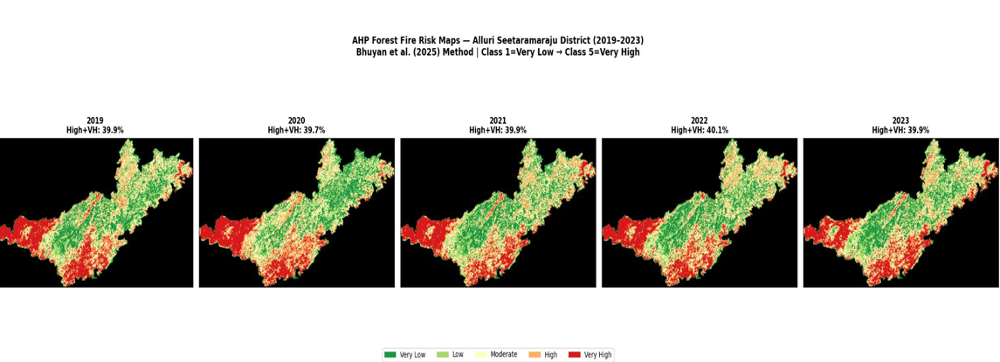
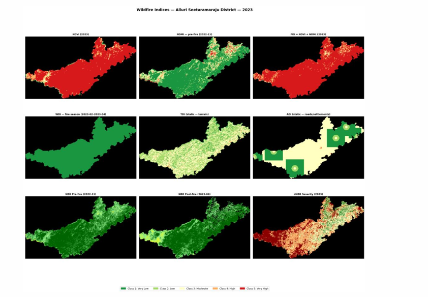
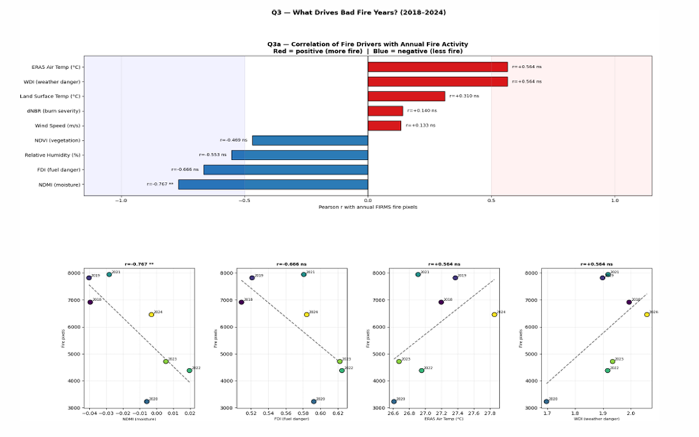
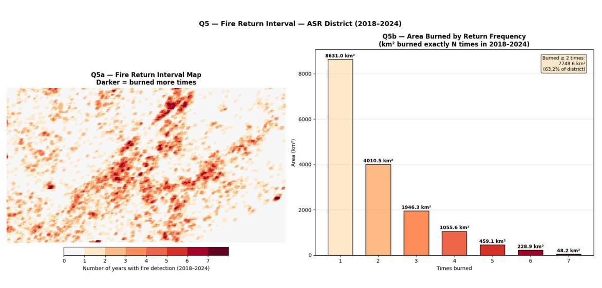

# Wildfire Risk Analysis: Multi-Temporal Mapping of Forest Disturbance and Recovery

## Overview

This project analyzes forest disturbance and recovery dynamics in the **Alluri Sitaram Raju (ASR) district** of Andhra Pradesh, India — a biodiversity-rich region in the Eastern Ghats with approximately 64% forest cover (~7,838 km²). Using multi-temporal satellite remote sensing data spanning **2018–2024**, the study maps wildfire occurrence, assesses burn severity, models wildfire risk, and evaluates post-fire vegetation recovery patterns. The project also examines the ecological impact of recurring disturbances on threatened and near-threatened species habitats within the district.

---
## Highlights

- Analyzed wildfire activity from 2018–2024 using MODIS, Landsat, ERA5, and FIRMS datasets
- Built AHP-based wildfire risk model using environmental and anthropogenic factors
- Identified repeat-burning hotspots affecting ~63% of study area
- Performed biodiversity habitat recovery analysis for 31 threatened species
- 

---

## Objectives

1. Analyze temporal patterns of forest fire occurrence using MODIS FIRMS active fire datasets.
2. Assess vegetation condition, fuel availability, and moisture stress using spectral indices (NDVI, NDMI, NBR, dNBR).
3. Identify wildfire-prone regions by developing a composite wildfire risk model using the **Analytic Hierarchy Process (AHP)**.
4. Evaluate burn severity and post-fire vegetation recovery using multi-temporal Landsat imagery.
5. Perform temporal trend analysis of wildfire activity and vegetation recovery using Mann-Kendall and Sen's slope estimator.
6. Identify repeat-burning hotspots and long-term disturbance patterns.
7. Assess potential impacts of forest disturbance on biodiversity and habitat conditions for selected threatened species.
8. Support sustainable forest management and conservation planning using geospatial analysis.

---

## Datasets Used

| Dataset | Source | Parameters | Spatial Resolution | Purpose |
|---|---|---|---|---|
| MODIS MOD13Q1 | NASA/USGS | NDVI | 250 m | Vegetation condition & fuel analysis |
| MODIS FIRMS | NASA | Active fire detections | 1 km | Fire occurrence & temporal analysis |
| Landsat 8/9 Surface Reflectance | USGS | NDMI, NBR, dNBR | 30 m | Burn severity & vegetation recovery |
| ERA5-Land | ECMWF | Temperature, humidity, wind speed | ~9 km | Weather danger analysis |
| SRTM DEM | USGS | Elevation, slope, aspect | 30 m | Topographic analysis |
| Oxford Accessibility Dataset | Oxford | Travel-time accessibility | 100 m | Anthropogenic activity analysis |
| GPW v4 / WorldPop | SEDAC | Population density | 100 m – 1 km | Human disturbance assessment |
| ESA / APSAC LULC | ESA/APSAC | Land use / land cover | 10–30 m | Wildfire risk modelling |
| FSI ISFR Reports | Forest Survey of India | Fire season calendars | State level | Fire season validation |
| GBIF | Global Biodiversity Information Facility | Species occurrence records | Point data | Biodiversity & habitat analysis |

---

## Technologies Used

- **Google Earth Engine (GEE)** — Cloud-based satellite data processing and geospatial analysis
- **Python** — Data analysis, statistical testing, and visualization
  - `NumPy` — Numerical computations
  - `SciPy` — Statistical analysis
  - `Matplotlib` — Data visualization and plotting
  - `PyMannKendall` — Non-parametric trend testing
- **GIS Tools** — Spatial data processing and map generation
- **AHP (Analytic Hierarchy Process)** — Multi-criteria decision analysis for composite risk modelling

---

## Methodology / Workflow

```
1. Fire Season Determination
   ├── MODIS FIRMS monthly fire pixel counts (2019–2023)
   └── FSI ISFR fire calendars (Andhra Pradesh)
       → Confirmed fire season: February 15 – April 30

2. Spectral Index Computation
   ├── NDVI  — Vegetation greenness & fuel density (MODIS MOD13Q1, 250 m)
   ├── NDMI  — Canopy moisture & drought stress (Landsat 9, 30 m)
   ├── FDI   — Fuel Danger Index = NDVI + NDMI (normalized)
   ├── ADI   — Activity Danger Index (accessibility + population density)
   ├── WDI   — Weather Danger Index (LST + RH + wind speed)
   ├── TDI   — Topographic Danger Index (slope + aspect, SRTM)
   ├── NBR   — Normalized Burn Ratio (pre/post-fire, Landsat 9)
   └── dNBR  — Differenced NBR for burn severity classification

3. AHP Composite Wildfire Risk Modelling
   ├── 8 input factors: LST, elevation, NDVI, NDMI, LULC, aspect, wind speed, slope
   ├── Pairwise comparison matrix (CR = 0.078 < 0.10 ✓)
   ├── Risk = Σ(wi × Xi) → classified into 5 risk zones
   └── Validation using MODIS FIRMS fire detections (2019–2023)

4. Temporal Analysis (2018–2024)
   ├── Q1 — Trend Analysis: Mann-Kendall test + Sen's slope on annual fire pixels
   ├── Q2 — Anomaly Analysis: Z-score normalization across 6 indices
   ├── Q3 — Driver Correlation: Pearson r between fire pixels & 9 environmental variables
   ├── Q4 — Post-Fire Recovery: Seasonal NDVI windows (pre-fire, fire season, post-monsoon)
   └── Q5 — Fire Return Interval (FRI): Pixel-wise fire frequency map (0–7 years)

5. Biodiversity & Species Habitat Analysis
   ├── 31 threatened/near-threatened species mapped from GBIF + literature
   ├── NDVI time-series extracted at species habitat coordinates (2018–2024)
   ├── Habitat disturbance (ΔNDVI 2018–2020) & recovery slope (2020–2024)
   ├── Kruskal-Wallis test across IUCN categories
   └── Conservation Priority Index (CPI) ranking
```

---

## Project Structure

```
wildfire-risk-analysis/
│
├── notebooks/
│   ├── 01_fire_season_analysis_2018.ipynb          # Fire season determination (FIRMS + FSI, 2018)
│   ├── 02_temporal_fire_analysis_2018_2023.ipynb   # Temporal fire trend, anomaly & correlation analysis
│   ├── 03_species_habitat_assessment.ipynb         # Species distribution & habitat condition (GBIF + NDVI)
│   └── 04_temporal_species_recovery_analysis.ipynb # Post-fire vegetation & species habitat recovery
│
├── docs/
│   ├── final_report.pdf                    # Complete project report
│   ├── forest_fire_final_presentation.pdf  # Final presentation (maps, plots & results)
│   ├── forest_fire_midterm_evaluation.pdf  # Midterm progress evaluation report
│   └── wildfire_risk_maps_and_plots.pptx   # Wildfire risk maps and analytical plots (PowerPoint)
│
└── README.md
```

---

## Results and Visualizations

| Figure | Description |
|---|---|
| Fig 1–3 | Monthly/bi-weekly FIRMS fire pixel counts; fire season validation |
| Fig 4–8 | NDVI, NDMI, FDI, ADI, TDI spatial maps |
| Fig 9–23 | AHP risk factor maps and composite wildfire risk map |
| Fig 24 | Annual fire pixel trend (2018–2024) with Mann-Kendall output |
| Fig 25 | Anomaly heatmap across 6 indices (dNBR, LST, NDVI, WDI, FDI, NDMI) |
| Fig 26 | Pearson correlation matrix — environmental drivers vs. fire intensity |
| Fig 27 | Post-fire vegetation recovery rates by year (Ry %) |
| Fig 28 | Fire Return Interval (FRI) map — repeat burning hotspots |
| Fig 29–30 | Species habitat disturbance vs. recovery scatter plot |
| Fig 31 | Kruskal-Wallis test output by IUCN category |
| Fig 32–33 | Per-species NDVI recovery slopes and CPI ranking |
| Fig 34–38 | Annual FIRMS validation overlays on AHP risk map (2019–2023) |

---
## Sample Results

### Composite Wildfire Risk Map


### Burn Severity (dNBR)


### Environmental Driver Correlation


### Fire Return Interval (FRI)


---

## Key Findings

- **Fire Season:** February 15 – April 30 confirmed as the peak fire window; March is the single-month peak. Fire counts drop to near-zero during the monsoon months (June–September).
- **COVID-19 Natural Experiment:** 2020 recorded the lowest fire activity (z = −1.47) due to pandemic mobility restrictions — confirming human activity as the dominant ignition driver in the ASR district.
- **Primary Fire Driver:** NDMI (vegetation moisture) is the strongest predictor of interannual fire intensity (r = −0.767, p < 0.05). Pre-fire NDMI monitoring during November–January can provide a 2–3 month lead-time forecast of fire season severity.
- **Burn Severity:** Widespread low-to-moderate burn severity across western and southern ASR, with high-severity patches concentrated near human-accessible areas (high ADI zones).
- **Wildfire Risk:** Unlike the reference study area (Malkangiri, Odisha), ASR shows a substantially elevated risk profile — High and Very High risk zones cover a much larger proportion of the landscape, attributable to higher tree cover, population density, and agricultural encroachment.
- **Vegetation Recovery:** Post-monsoon NDVI recovery exceeded 100% in all 7 study years, demonstrating strong ecosystem resilience. Weakest recovery was observed in 2019 (R = 144.2%), the second-highest fire activity year.
- **Repeat Burning:** ~63.2% of the district (7,748.6 km²) burned at least twice in 7 years. 48.2 km² burned in all 7 years. Repeat burning threatens long-term forest regeneration and risks triggering a grass-fire cycle.
- **Biodiversity Impact:** 31 threatened/near-threatened species identified in the district. Mahseer (fish) showed the most negative NDVI recovery slope (−0.0097/year), indicating progressive riparian habitat degradation. Highest conservation priority species include Red-crowned Roofed Turtle (CR), Gharial (CR), Dhole (EN), and Bengal Tiger (EN).
- **Model Validation:** AHP model CR = 0.078 (< 0.10); FIRMS fire detections consistently fell within High/Very High risk zones across all validation years (2019–2023).

---

## How to Run

### Prerequisites

```bash
pip install numpy scipy matplotlib pymannkendall earthengine-api geopandas rasterio
```

### Authentication (Google Earth Engine)

```bash
earthengine authenticate
```

### Steps

```bash
# 1. Clone the repository
git clone https://github.com/your-username/wildfire-risk-analysis.git
cd wildfire-risk-analysis

# 2. Launch Jupyter and run notebooks in order
jupyter notebook
```

Run the notebooks in the following sequence:

| Step | Notebook | Description |
|---|---|---|
| 1 | `01_fire_season_analysis_2018.ipynb` | Fire season determination using FIRMS & FSI data |
| 2 | `02_temporal_fire_analysis_2018_2023.ipynb` | Trend analysis, anomaly ranking, driver correlations, FRI mapping |
| 3 | `03_species_habitat_assessment.ipynb` | Species distribution mapping & NDVI habitat condition |
| 4 | `04_temporal_species_recovery_analysis.ipynb` | Post-fire vegetation recovery & CPI ranking |

> **Note:** All notebooks require a registered **Google Earth Engine** account. Authenticate before running:
> ```python
> import ee
> ee.Authenticate()
> ee.Initialize()
> ```
> Large raster exports are processed via GEE Tasks and saved to Google Drive before local analysis.

---

## Future Improvements

- Integrate **machine learning models** (Random Forest, XGBoost) as alternatives to AHP for wildfire risk prediction and comparison.
- Extend the temporal analysis beyond 2024 as new Landsat 9 and Sentinel-2 data become available.
- Incorporate **SAR (Synthetic Aperture Radar)** data (e.g., Sentinel-1) for burn severity mapping under cloud cover — particularly useful during the monsoon transition period.
- Develop a **near-real-time fire risk dashboard** using GEE Apps for forest department use.
- Expand the biodiversity analysis to include acoustic monitoring and camera trap data for ground-truthing species distributions.
- Conduct **community-level fire behavior surveys** to better quantify the anthropogenic ignition component (podu cultivation, grazing burns).
- Apply the methodology to other vulnerable Eastern Ghats districts for regional-scale disturbance assessment.

---

## References

- Aditya, V., & Ganesh, T. (2017). Biodiversity patterns in the Eastern Ghats forests. *Journal of Threatened Taxa*, 9(7), 10471–10482.
- Bhuyan, J. M., et al. (2025). Forest fire risk mapping using AHP: A case study of Malkangiri district, Odisha. *Journal of Geomatics*, 19(2), 188–201.
- Cochrane, M. A. (2003). Fire science for rainforests. *Nature*, 421(6926), 913–919.
- D'Antonio, C. M., & Vitousek, P. M. (1992). Biological invasions by exotic grasses, the grass/fire cycle, and global change. *Annual Review of Ecology and Systematics*, 23(1), 63–87.
- Forest Survey of India. (2021 & 2023). *India State of Forest Report*. MoEFCC, Government of India.
- Key, C. H., & Benson, N. C. (2006). Landscape assessment: dNBR and NBR methodology. In *FIREMON*. USDA Forest Service.
- Kendall, M. G. (1975). *Rank Correlation Methods* (4th ed.). Charles Griffin, London.
- Mahesh, R., Aravind, N. A., & Rao, D. (2022). Amphibian and reptile diversity of the Eastern Ghats. *Herpetological Conservation and Biology*, 17(2), 280–298.
- Mondal, P., & Southworth, J. (2010). Evaluation of conservation interventions using a CA-Markov model. *Forest Ecology and Management*, 260(10), 1716–1725.
- Nepstad, D., et al. (2004). Amazon drought and forest flammability. *Global Change Biology*, 10(5), 704–717.
- Ray, P., Bhatt, D., & Pandav, B. (2020). Wildlife distribution in the Eastern Ghats landscape. *Current Science*, 118(9), 1392–1400.
- Roy, D. P., et al. (2008). Global fire-affected area mapping using MODIS. *Remote Sensing of Environment*, 97(2), 137–162.
- Sen, P. K. (1968). Regression coefficient estimates based on Kendall's tau. *JASA*, 63(324), 1379–1389.
- Sultan, A., et al. (2025). Wildfire indicators modelling for Vellore district using multi-source geodata. *Frontiers in Remote Sensing*, 6, 1518539.
- Tucker, C. J. (1979). Red and photographic infrared linear combinations for monitoring vegetation. *Remote Sensing of Environment*, 8(2), 127–150.

---

## Authors

| Name | Roll No | Institution |
|---|---|---|
| Nunna Sri Abhinaya | 2023102071 | Lab for Spatial Informatics, IIIT Hyderabad |
| G. Valli | 2023102068 | Lab for Spatial Informatics, IIIT Hyderabad |

**Faculty Advisor:** Prof. R. C. Prasad, Lab for Spatial Informatics, IIIT Hyderabad

---

*This project was conducted as part of academic research at the Lab for Spatial Informatics, IIIT Hyderabad. All datasets used are publicly available. Computational processing was performed using Google Earth Engine.*
